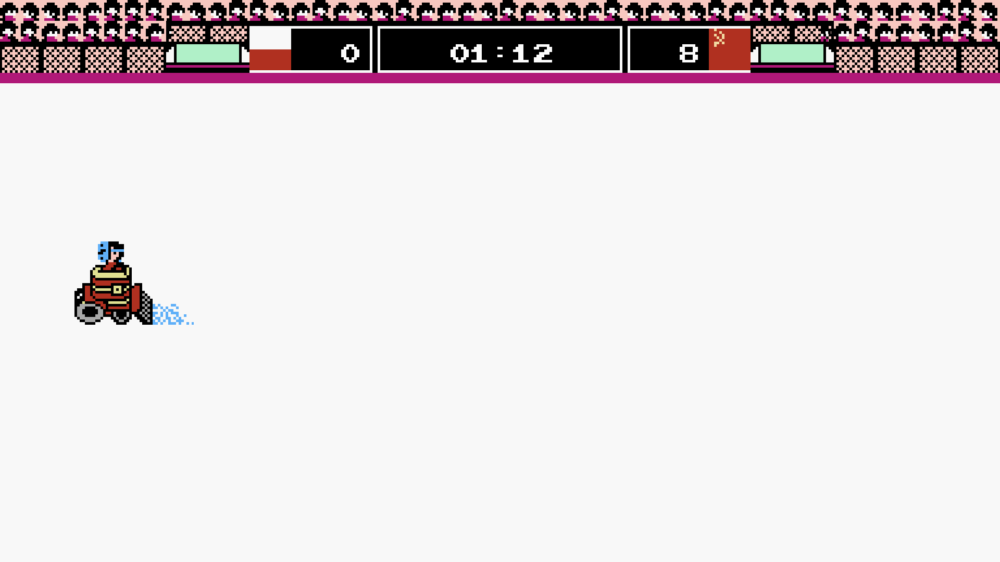

# Hockey Fight (Windows)

A Windows screensaver featuring zamboni action. This is a port of the macOS
screensaver in [`../macos`](../macos).



## Installation

### Build and install

Requires the [.NET 10 SDK](https://dotnet.microsoft.com/download).

```powershell
.\build.ps1
```

This publishes `Hockey Fight.scr`, copies it to
`%LOCALAPPDATA%\Hockey Fight\`, and selects it as the current screensaver. No
administrator rights are needed — the screensaver is registered by pointing
`HKCU\Control Panel\Desktop\SCRNSAVE.EXE` at that path rather than by writing
into `System32`.

Open **Settings → Personalization → Lock screen → Screen saver** to preview it or
change the timeout.

To remove it again:

```powershell
.\build.ps1 -Task uninstall
```

### Installing the `.scr` by hand

`Hockey Fight.scr` is a normal executable, so you can also right-click it and
choose **Install**, or copy it into `C:\Windows\System32\` (needs administrator
rights) to make it available to every user.

## Development

Built with:

- C# / .NET 10
- WinForms hosting, GDI+ (`System.Drawing`) rendering
- Sprite sheets embedded as assembly resources

### Building

Build and install for development (default):

```powershell
.\build.ps1
```

Build without installing (output lands in `dist\`):

```powershell
.\build.ps1 -Task build
```

Build a self-contained release into `release\` — larger, but runs on machines
without the .NET runtime installed:

```powershell
.\build.ps1 -Task release
```

Remove build artifacts:

```powershell
.\build.ps1 -Task clean
```

By default the build is framework-dependent and the `.scr` is only ~200 KB, but
it needs the **.NET 10 Desktop Runtime** on the machine. Pass `-SelfContained`
to bundle the runtime instead.

### Running it directly

A screensaver is driven entirely by its command-line switch:

| Switch | Meaning |
| --- | --- |
| `/s` | Run full screen |
| `/p <hwnd>` | Render the preview thumbnail into the given window |
| `/c[:<hwnd>]` | Show the configuration dialog |
| `/w` | Run in a resizable window (not a Windows switch; for development) |

```powershell
dotnet run -- /w
```

Note that launching a `.scr` through the shell (`Start-Process` without
`-NoNewWindow`, or double-clicking) uses the file type's default **Install**
verb, which runs it full screen and ignores whatever arguments you passed. Run
the executable directly when you want a specific switch to take effect.

## Architecture

### Screensaver lifecycle

macOS supplies the `ScreenSaver` framework; on Windows the equivalent plumbing is
written by hand, so the port splits the original single view class in two:

| macOS (`Hockey_FightView.m`) | Windows |
| --- | --- |
| `ScreenSaverView` subclass | `ScreenSaverForm` — window, timer, input handling |
| `-drawRect:`, `-animateOneFrame` | `HockeyFightRenderer` — all drawing and physics |
| Instantiated per display by the OS | `Program` creates one form per `Screen` |
| `-hasConfigureSheet` returns `NO` | `/c` shows a "no settings" message |

`HockeyFightRenderer` is a close port of `Hockey_FightView.m`: the same sprite
metrics, the same delta-time Euler integration, the same one-second animation
tick, and the same layout arithmetic.

### Coordinate system

AppKit draws with the origin at the bottom-left and Y increasing upwards; GDI+
puts the origin at the top-left with Y increasing downwards. Rather than rewrite
every layout calculation, the renderer keeps all of them in the original
bottom-left space and converts in exactly one place — `HockeyFightRenderer.Rect()`
— so the drawing code still reads alongside the Objective-C it came from.

### Scaling

The scene is laid out around a 1292×120 scoreboard, and the macOS original runs
on a Retina display where that fills roughly three quarters of the width. To keep
those proportions, the whole scene is drawn through an integer zoom chosen as the
largest one that still leaves room for the scoreboard plus a net tile either
side. On a 3840×2160 display that is 2×; on a 1920×1080 display it is 1×, which
is pixel-for-pixel identical to the non-Retina original. The preview thumbnail is
the exception: it uses a fractional scale so the entire rink fits in the small
window instead of showing a corner of it.

The process is per-monitor DPI aware, so the scene is laid out in real pixels.
Note that `Form.ClientSize` reports DPI-scaled logical units and cannot be used
for this; the renderer takes its size from `GetClientRect` instead.

### Project structure

- `src/Program.cs` — entry point and command-line switch handling
- `src/ScreenSaverForm.cs` — the window: full screen, preview, and windowed modes
- `src/HockeyFightRenderer.cs` — port of the drawing and animation logic
- `src/Sprites.cs` — loads the embedded sprite sheets
- `src/NativeMethods.cs` — the Win32 calls the preview mode needs
- `Resources/` — sprite sheets, embedded into the executable at build time
- `build.ps1` — build, install, release and clean tasks
